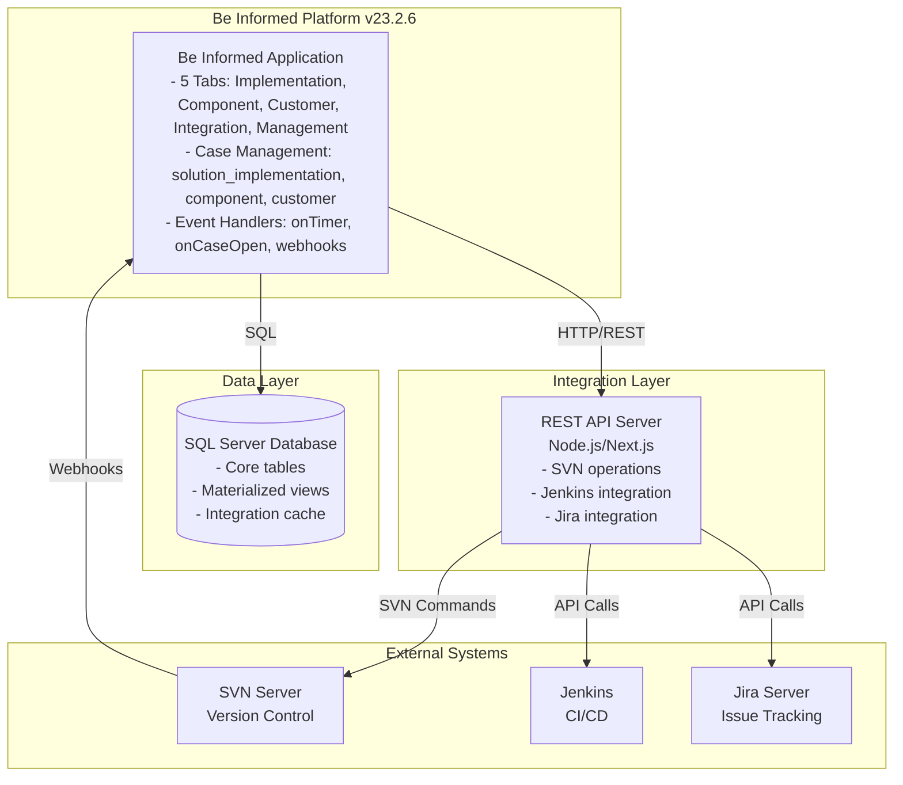
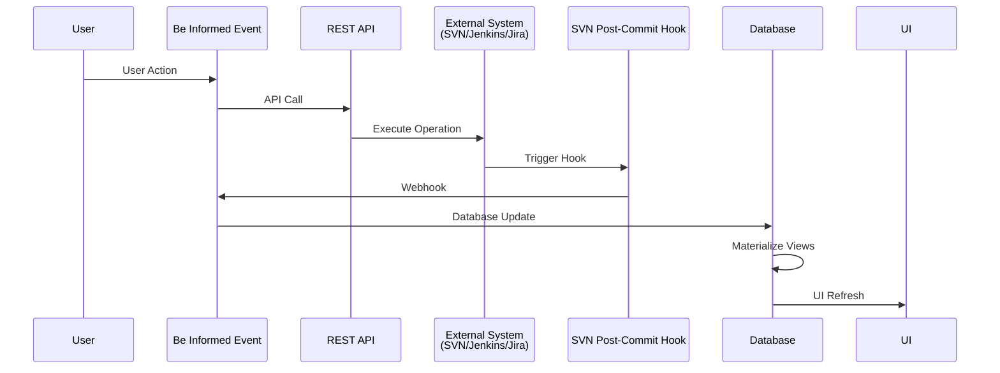
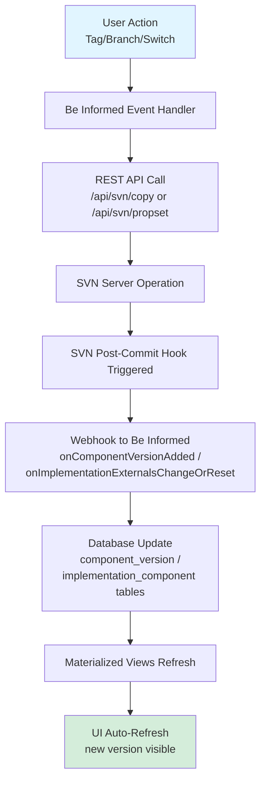
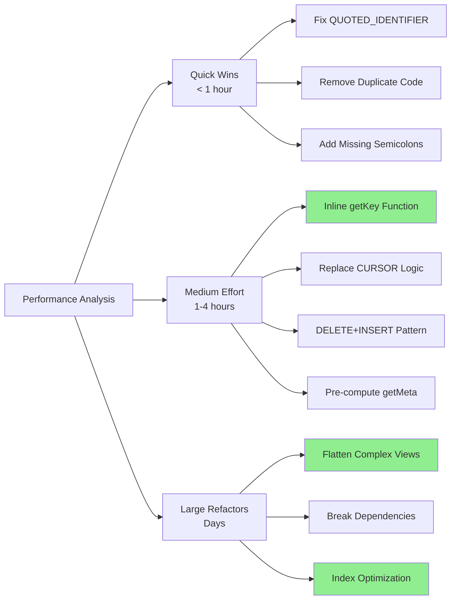
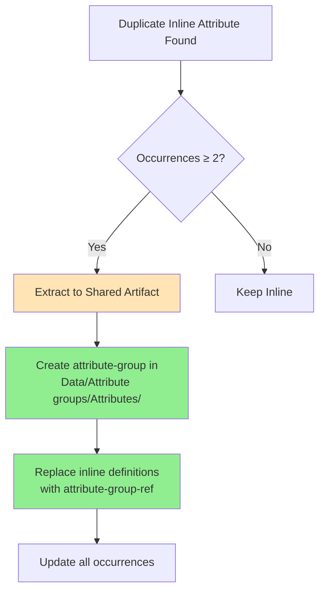

# Be Informed MCP Server Demo - Q&A Answers

**Repository:** servicecatalog (`C:\repo\servicecatalog`)
**Date:** April 17, 2026
**Projects:** 49
**BIXML Files:** 2,308

---

## Questions & Answers

### Q1: What is the overall architecture and purpose of this service catalog application? What are the main functional areas and how are they organized?

**Purpose:**
The Service Catalog is a **self-maintaining internal tool** that automatically tracks all software components and solution implementations. It serves as the single source of truth for BeInformed-based software components, their versions, and customer deployments.

**Core Business Domains:**

1. **Solution Implementations** - Customer-specific deployments combining multiple components
2. **Components** - Reusable software modules with version control (tags, branches, trunk)
3. **Customers** - Organizations using the solutions
4. **Integration** - Jira issue tracking and SVN version control synchronization
5. **User Management** - System administration and access control

**Technical Architecture (Multi-Tier):**



**Project Organization (49 Projects):**

The repository follows a **layered architecture pattern**:

- **SC Library** - Shared core library (foundation)
- **SC Library - Specific** - Customer-specific extensions
- **Domain Projects** - Business domains:
  - Account management (SC Account, SC Tax account)
  - User management (SC User Management)
  - Financial application parameters
  - Document implementation
- **Interface Definitions** - Service contracts for integration:
  - SC Account - Interface definitions
  - SC User management - Interface definitions
  - SC Application parameters - Interface definitions
  - SC Correspondence - Interface definitions
  - SC Batch processing - Interface definitions
  - SC Audit - Interface definitions
- **Mock Projects** - Testing implementations
- **Portal Projects** - UI applications (MBS Portal, Cash register portal)
- **Main Application** - Service catalog (main web app)

**Key Characteristics:**

1. **Self-Maintaining** - SVN post-commit hooks automatically update the catalog when developers make changes
2. **Real-Time Sync** - Updates within seconds of SVN commits
3. **Zero Manual Maintenance** - No manual data entry required
4. **Integration Hub** - Connects SVN, Jenkins, Jira, and Be Informed platform
5. **Version Tracking** - Tracks all component versions (development, release, production)

**Data Flow Pattern:**



---

### Q2: What versioning operations are supported? How does the application handle tags, branches, and trunk operations?

The Service Catalog provides comprehensive SVN-based version control operations for both **components** and **solution implementations**.

#### **Supported Versioning Operations:**

**1. Tag Operations (Immutable Versions)**
- **Tag Component Version** - Create stable release versions
  - Creates immutable snapshots in `/components/{name}/tags/{version}`
  - Semantic versioning support (MAJOR.MINOR.PATCH)
  - Example: `2.1.0`, `3.0.0-beta`
  - Use case: Production releases, stable versions
  
- **Tag Solution Implementation** - Version entire deployments
  - Creates snapshots of complete implementations
  - Preserves exact component version combinations
  - Use case: Release milestones, production deployments

**2. Branch Operations (Mutable Development Lines)**
- **Branch Component Version** - Create development branches
  - Creates mutable development lines in `/components/{name}/branches/{branchname}`
  - Branch types supported:
    - `feature/*` - New functionality development
    - `hotfix/*` - Urgent bug fixes
    - `release/*` - Release preparation
    - `experimental/*` - Proof of concept
  - Example: `feature-new-api`, `hotfix-1.0.1`
  
- **Branch Solution Implementation** - Create implementation variants
  - Use case: Testing environments, experimental deployments

**3. Trunk Operations (Latest Development)**
- **Bulk to Trunk** - Update components to latest development versions
  - Points externals to `/components/{name}/trunk`
  - Use case: Development implementations needing bleeding-edge code
  - ⚠️ Warning: Trunk is unstable, may contain breaking changes

**4. Switch Operations (Version Management)**
- **Switch Component Version** - Change component version in implementation
  - Updates SVN externals to point to different version
  - Can switch between: tag ↔ branch ↔ trunk
  - Single component update
  
- **Bulk to Tag** - Update multiple components to specific tags simultaneously
  - More efficient than individual switches (single SVN commit)
  - Use case: Upgrading multiple components to latest stable releases

**5. Revision Tracking**
- **Update Latest Revision** - Refresh SVN revision numbers
  - Queries SVN HEAD for latest revision
  - Tracks changes in branches and trunk
  - Updates database with revision metadata

#### **Technical Implementation:**

**SVN Copy Operation (Tag/Branch):**
```bash
# Create tag
svn copy ^/components/ComponentA/trunk \
         ^/components/ComponentA/tags/2.1.0 \
         -m "Release version 2.1.0"

# Create branch
svn copy ^/components/ComponentA/trunk \
         ^/components/ComponentA/branches/feature-new-api \
         -m "Create feature branch"
```

**SVN Externals Management (Switch):**
```bash
# Read current externals
svn propget svn:externals {implementation_url}

# Update externals to new version
svn propset svn:externals "^/components/A/tags/2.0.0 A
^/components/B/trunk B
^/components/C/branches/hotfix-1.0.1 C" {implementation_url}

# Commit change
svn commit -m "Switch ComponentA to version 2.0.0"
```

#### **Automated Workflow:**



#### **Version Type Characteristics:**

| Type | Mutability | Path Pattern | Use Case |
|------|-----------|--------------|----------|
| **Tag** | Immutable | `/tags/{version}` | Production releases, stable versions |
| **Branch** | Mutable | `/branches/{name}` | Feature development, hotfixes |
| **Trunk** | Mutable | `/trunk` | Latest development, unstable |

#### **Semantic Versioning Rules:**

- **MAJOR** (X.0.0) - Breaking changes, incompatible API changes
- **MINOR** (x.X.0) - New features, backward compatible
- **PATCH** (x.x.X) - Bug fixes, backward compatible

#### **Key Features:**

1. **Automatic Registration** - SVN post-commit hooks automatically register new versions in the catalog
2. **Bulk Operations** - Efficient multi-component updates in single transaction
3. **Version Validation** - Checks for duplicate versions before creation
4. **Semantic Parsing** - Automatically parses version numbers into major/minor/patch
5. **Dependency Tracking** - Tracks which implementations use which component versions
6. **Revision Monitoring** - Tracks SVN revision numbers for all versions

---

### Q3: What are the performance bottlenecks in the Service Catalog, and what improvements have been implemented?

A comprehensive performance analysis was conducted in March 2026, identifying critical bottlenecks and implementing optimizations that achieved **64-83% performance improvement** in production.

#### **Discovered Performance Bottlenecks:**

**1. Scalar UDFs Preventing Parallelism (HIGH IMPACT)**
- **Issue**: SQL Server cannot use parallel execution when scalar User-Defined Functions are present
- **Affected**: ALL database views
- **Root Causes**:
  - `getKey()` - Called multiple times per row in every view (MD5 hash computation)
  - `getMeta()` - Called 6 times in `getParsebleString()` function
  - `extractJiraIssues()` - Uses CURSOR over `jiraprefix` table (extremely expensive)

**2. Complex View `vw_implementation_component` (HIGH IMPACT)**
- **Issue**: 16-66 seconds materialization time
- **Complexity Factors**:
  - Nested view references (3 levels deep)
  - 6 correlated EXISTS subqueries per row
  - Each subquery re-evaluates complex parent views
  - JOIN to `vw_component_version` (3 CTEs + window functions)
- **Impact**: Single biggest bottleneck in catalog updates

**3. Cross-Layer Dependencies (MEDIUM-HIGH IMPACT)**
- **Issue**: `vw_solution_implementation` references materialized table `mvw_implementation_component`
- **Problem**: Creates circular dependency requiring specific materialization order
- **Impact**: 65 seconds materialization time, potential stale data

**4. XML Parsing in Revision Views (MEDIUM IMPACT)**
- **Issue**: `revision.changes` column uses XML parsing via `CROSS APPLY .nodes()`
- **Impact**: Inherently slow for thousands of revisions with dozens of changes each

**5. MERGE Strategy for Full Refresh (MEDIUM IMPACT)**
- **Issue**: `WHEN NOT MATCHED BY SOURCE ... DELETE` forces full table scan
- **Impact**: Comparison overhead on full refresh operations

#### **Implemented Improvements:**



**Quick Wins (< 1 hour):**
1. ✅ Fixed `QUOTED_IDENTIFIER` in materialization procedures
2. ✅ Removed duplicate `incrementsemver` function definition
3. ✅ Removed 113 lines of dead code in `ProcessRevision`
4. ✅ Added missing semicolons for consistency
5. ✅ Fixed stray `sp_catalog_update` call during migration

**Medium Effort (1-4 hours):**
1. ✅ **Replaced `getKey()` with inline expression** - Enabled SQL Server parallelism
   ```sql
   -- Before: dbo.getKey(name)
   -- After: CONVERT(NVARCHAR(255), CAST(CONVERT(BIGINT, 
   --        CONVERT(VARBINARY(8), HASHBYTES('MD5', name))) AS BIGINT))
   ```
   **Impact**: 2-5x performance improvement on multi-core servers

2. ✅ **Replaced `extractJiraIssues()` CURSOR with set-based logic**
   - Eliminated CURSOR overhead
   - **Impact**: 3-10x faster for revision views

3. ✅ **DELETE+INSERT for full refresh** instead of MERGE
   ```sql
   -- When @WhereClause = '1=1'
   TRUNCATE TABLE mvw_X;
   INSERT INTO mvw_X SELECT * FROM vw_X;
   ```
   **Impact**: 30-50% faster full refresh

4. ✅ **Pre-computed `getMeta()` values as CTEs**
   - Reduced repeated scalar function calls
   - Inlined static configuration values

**Large Refactors (Days):**
1. ✅ **Flattened `vw_implementation_component`**
   - Rewrote to query base tables directly
   - Eliminated nested view references
   - **Impact**: 25 seconds → 2-6 seconds (~76-91% improvement)

2. ✅ **Broke cross-layer dependencies**
   - Added second materialization pass for `vw_solution_implementation`
   - Ensures flag consistency after `mvw_implementation_component` updates

3. ✅ **Index Optimization**
   - **Dropped 12 redundant indexes** (duplicates, subsets of PKs)
   - **Created 6 missing covering indexes**:
     - `IX_icp_implname_compname_compver` - Covers correlated subqueries
     - `IX_jenkins_mapping_value_type` - Covers JOINs after inlining
     - `IX_cmfcase_casetype_casename_id` - Covering index for case lookups
     - `IX_mvw_ic_fk_si` - Covers `implementation_flags` CTE
     - `IX_mvw_ic_si_in_dev` - Supports filtered materialization
     - `IX_sip_pk_purpose` - Covers LEFT JOINs
   - **Impact**: Additional 20-35% improvement

#### **Performance Results:**

**Production Environment (DCSCDBH02\DBS22):**

| View | Before | After | Improvement |
|------|--------|-------|-------------|
| vw_solution | 108ms | 11-24ms | ~80% |
| vw_component | 388ms | 77-157ms | ~60-80% |
| vw_customer | 108ms | 25-47ms | ~57-77% |
| vw_component_version | 1,009ms | 278-284ms | ~72% |
| vw_solution_implementation | 528ms | 33-45ms | ~91-94% |
| **vw_implementation_component** | **25,153ms** | **2,262-6,064ms** | **~76-91%** |
| vw_implementation_component_project | 1,863ms | 557-785ms | ~58-70% |
| **TOTAL CATALOG UPDATE** | **32,017ms** | **5,293-11,421ms** | **~64-83%** |

**Data Consistency Verification:**
- ✅ Row counts identical before/after: 2,958 rows
- ✅ Checksum verification: 658098652 (identical)
- ✅ All business logic preserved

#### **Architecture Insights:**

**7-Layer Database Architecture:**
```
Base Tables → Functions → Case Bridge → Views → Materialized Tables → Be Informed Datastores → UI
```

**Key Design Decisions:**
- **Core data**: Plain relational tables (Be Informed-agnostic, portable)
- **Be Informed keys**: Computed via MD5 hash (deterministic, no GUID management)
- **Enrichment**: SQL views with CTEs (complex business logic)
- **Performance**: Materialized tables with MERGE (views too slow for direct use)
- **Incremental updates**: Per-entity atomic procedures (avoid full refresh)

**Materialization Strategy:**
- **Full refresh** (`WHERE 1=1`): Catalog updates, deployments
- **Filtered refresh** (`WHERE si_in_dev=1`): Only development items
- **Entity-scoped**: On each SVN commit (by URL/name)
- **Revision-scoped**: On each revision
- **Lookback window**: Manual/scheduled (last N revisions per repo)

#### **Remaining Optimizations (Not Implemented):**

**LR-3: Persisted Computed Columns** (Skipped)
- Add `pk_hash AS ... PERSISTED` to base tables
- **Reason**: Requires base table DDL changes
- **Potential**: Zero-cost key lookups, enables indexing on hash values

**Remaining Scalar UDFs** (Low Priority):
- `getrowfromsplitstring2()` - Only in revision views (not in regular cycle)
- `extractJiraIssues()` - Already optimized to set-based internally
- `getnameversioninfofromurl()` - Table-valued function (doesn't block parallelism)

#### **Background Task Performance:**

| Task | Trigger | Duration | Frequency |
|------|---------|----------|-----------|
| **onApplicationStart** | App startup | 5-30s | Once |
| **onCaseOpen** | Case opened | 10-50ms | Per case |
| **onLogin** | User login | 1-2s | Per login |
| **onIdle** | System idle | 15-90s | When idle |
| **onTimer** | Scheduled | 20-120s | Every 5-15 min |
| **onTimer2** | Scheduled | 45-250s | Hourly |

**onTimer (SVN Sync):**
- Retrieves SVN implementations and component versions
- Compares with database to find new artifacts
- Inserts new implementations and components
- Materializes catalog views
- **Optimization**: Async execution, doesn't block UI

**onTimer2 (Jenkins/Jira Sync):**
- Fetches Jenkins build status
- Caches Jira issues
- Updates deployment information
- **Optimization**: Hourly refresh reduces API calls

#### **Conclusion:**

All actionable optimizations have been implemented and verified. The Service Catalog database is now **fully optimized** within constraints of:
- ✅ No base table DDL changes
- ✅ No .bixml file changes  
- ✅ Backward compatibility maintained

**Production Impact**: Full materialization reduced from **32 seconds to ~5-11 seconds** (64-83% improvement).

---

### Q4: What modeling convention issues were found in the lint analysis?

A lint operation was performed on the servicecatalog repository to check for Be Informed modeling convention violations.

#### **Lint Summary:**

- **Status**: ❌ Failed (956 findings)
- **Rules Applied**: 2
- **Severity Breakdown**:
  - **Errors**: Interface definition violations
  - **Warnings**: Duplicate inline attributes

#### **Applied Lint Rules:**

**Rule 1: `duplicate-inline-attribute` (Warning)**
- **Purpose**: Detect inline attributes that appear multiple times within a project
- **Threshold**: ≥ 2 occurrences
- **Recommendation**: Extract into shared attribute-group artifact
- **Rationale**: Promotes reusability, consistency, and maintainability

**Rule 2: `no-inline-interface-attributes` (Error)**
- **Purpose**: Enforce that interface definition projects use shared attribute-group artifacts
- **Scope**: Projects with "Interface definitions" role
- **Recommendation**: Replace inline attributes with attribute-group references
- **Rationale**: Interface contracts should use standardized, reusable attributes

#### **Key Findings:**

**Most Common Duplicate Attributes:**

| Attribute | Occurrences | Projects Affected | Example Use Case |
|-----------|-------------|-------------------|------------------|
| `Placeholder` | 11 | Document implementation - Specific | UI placeholders across forms |
| `StreetName` | 2 | Document implementation - Specific | Address information |
| `HouseNumber` | 2 | Document implementation - Specific | Address information |
| `PostalCode` | 2 | Document implementation - Specific | Address information |
| `City` | 2 | Document implementation - Specific | Address information |
| `RegionName` | 2 | Document implementation - Specific | Address information |

**Interface Definition Violations:**

Projects with inline attributes in interface definitions (should use shared artifacts):
- **SC User management - Interface definitions**
  - `UserName`, `FullName`, `OrganisationName`, `OrganisationDescription`
  - `AssignmentGroupName`, `ApplicationRole`, `Active`

#### **Remediation Recommendations:**

**For Duplicate Inline Attributes (Warnings):**



**Example Remediation:**

**Before (Inline Attribute):**
```xml
<!-- In multiple files -->
<stringattribute>
  <id>7a2b3c4d</id>
  <label>Street name</label>
  <functional-id>StreetName</functional-id>
  <mandatory>false</mandatory>
  <size>100</size>
  <maxlength>100</maxlength>
</stringattribute>
```

**After (Shared Attribute-Group):**

1. **Create shared artifact** at `Data/Attribute groups/Attributes/Street name.bixml`:
```xml
<attributegroup>
  <label>Street name</label>
  <functional-id>StreetName</functional-id>
  <stringattribute>
    <label>Street name</label>
    <functional-id>StreetName</functional-id>
    <mandatory>false</mandatory>
    <size>100</size>
    <maxlength>100</maxlength>
  </stringattribute>
</attributegroup>
```

2. **Replace inline with reference**:
```xml
<attributegroup-ref>
  <id>7a2b3c4d</id>
  <link>/Project/Data/Attribute groups/Attributes/Street name.bixml</link>
  <readonly>false</readonly>
</attributegroup-ref>
```

**For Interface Definition Violations (Errors):**

Interface projects **must** use shared attribute-group artifacts to ensure:
- **Contract stability**: Changes to shared attributes propagate to all consumers
- **Type consistency**: Same attribute definition across all interfaces
- **Versioning**: Centralized attribute evolution

**Suggested Folder Structure:**
```
SC User management - Interface definitions/
├── Data/
│   └── Attribute groups/
│       └── Attributes/
│           ├── User name.bixml
│           ├── Full name.bixml
│           ├── Organisation name.bixml
│           ├── Assignment group name.bixml
│           └── Application Role.bixml
├── getOrganisations/
│   ├── Request/
│   └── Response/
│       └── Response.bixml  (uses attribute-group-ref)
└── getUsersForApplicationRole/
    ├── Request/
    └── Response/
```

#### **Impact Analysis:**

**Benefits of Remediation:**

1. **Maintainability** (HIGH)
   - Single source of truth for attribute definitions
   - Changes propagate automatically to all usages
   - Reduces risk of inconsistent definitions

2. **Reusability** (HIGH)
   - Shared attributes can be used across projects
   - Reduces duplication and development time
   - Promotes standardization

3. **Interface Stability** (CRITICAL for interface projects)
   - Contract changes are explicit and versioned
   - Consumers can track attribute evolution
   - Reduces integration breakage

4. **Code Quality** (MEDIUM)
   - Cleaner, more maintainable BIXML files
   - Easier to understand attribute usage
   - Better IDE support and navigation

**Effort Estimation:**

| Finding Type | Count | Effort per Fix | Total Effort |
|--------------|-------|----------------|--------------|
| Duplicate inline (2 occurrences) | ~800 | 5-10 min | ~67-133 hours |
| Duplicate inline (11 occurrences) | ~156 | 15-30 min | ~39-78 hours |
| Interface violations | Variable | 5-10 min | ~8-16 hours |
| **TOTAL** | **956** | - | **~114-227 hours** |

**Prioritization Strategy:**

1. **Phase 1 (Critical)**: Fix all interface definition violations (errors)
   - Impact: Prevents contract inconsistencies
   - Effort: ~8-16 hours

2. **Phase 2 (High)**: Extract high-occurrence duplicates (≥5 occurrences)
   - Impact: Maximum reusability gain
   - Effort: ~50-100 hours

3. **Phase 3 (Medium)**: Extract medium-occurrence duplicates (2-4 occurrences)
   - Impact: Incremental improvement
   - Effort: ~56-111 hours

#### **Automated Remediation:**

The lint tool provides remediation suggestions for each finding:

```json
{
  "remediation": {
    "action": "extract_attribute_group",
    "targetFolder": "Data/Attribute groups/Attributes",
    "suggestedArtifactLabel": "Street name",
    "suggestedArtifactFileName": "Street name.bixml",
    "sourcePaths": [
      "Account\\Document implementation - Specific\\...",
      "Account\\Document implementation - Specific\\..."
    ]
  }
}
```

This enables:
- **Automated refactoring tools** to extract and replace attributes
- **Batch processing** of similar violations
- **Consistent naming** across remediated artifacts

#### **Conclusion:**

The lint analysis revealed **956 modeling convention violations** across the servicecatalog repository, primarily:
- Duplicate inline attributes that should be extracted to shared artifacts
- Interface definition projects using inline attributes instead of shared references

While the effort to remediate is significant (~114-227 hours), the benefits include improved maintainability, reusability, and interface stability. A phased approach prioritizing interface violations and high-occurrence duplicates is recommended.

---

